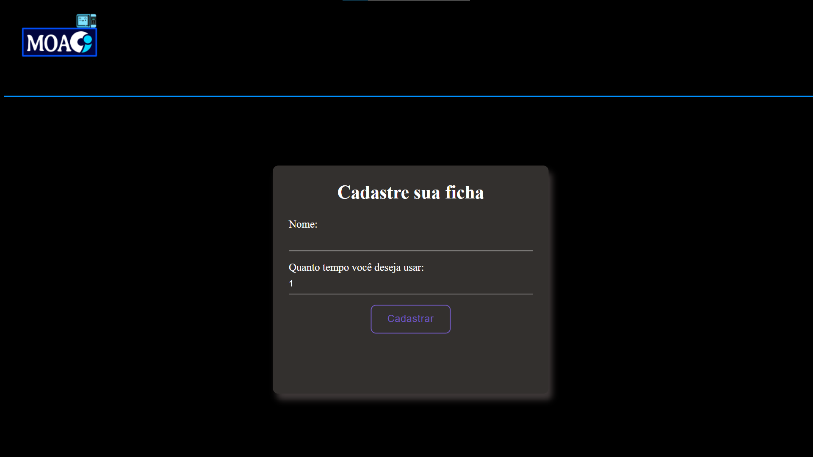
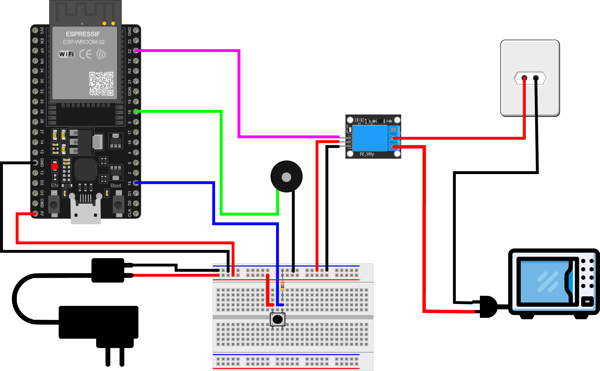

# Projeto MOACI

​	O MOACI é um projeto que possui como principal objetivo desenvolver um sistema de gerenciamento eficiente para o uso do micro-ondas no Centro de Informática da UFPB. A meta é proporcionar aos estudantes uma maneira organizada de acessar o aparelho e aumentar a eficiência do tempo de espera na fila, especialmente nos dias de maior utilização. 

​	Dessa forma, esse trabalho consiste na criação de um sistema de gestão que aproveita as capacidades do ESP32 como roteador para hospedar um site interativo. Com isso, o estudante interessado no uso do micro-ondas acessa o site, insere seu nome e escolhe a duração desejada para aquecer sua refeição, variando de 1 a 5 minutos. Após o preenchimento das informações, o sistema direciona o estudante para uma fila de espera, onde ele pode visualizar quantas pessoas estão na fila e o tempo estimado que cada uma definiu para aquecer a comida. 

## Pesquisa e Resultados

Para fundamentar as preferências do sistema, foi aplicado um formulário, no qual entrevistou-se os alunos do CI para coletar informações relevantes que direcionaram o desenvolvimento do projeto. Os principais resultados da pesquisa incluem: 

- Os dias de maior utilização do micro-ondas são segunda e quarta-feira. 

- 44% dos entrevistados possuem uma satisfação de nível 3 em uma escala de 1 a 5. 

- 37,5% dos entrevistados esperam cerca de 20 minutos para aquecer seu alimento, enquanto 34,4% esperam de 10 a 15 minutos. 

- A maioria dos entrevistados (31,3%) demora entre 1 a 2 minutos para esquentar comida, seguido de 31,3% que demora entre 3 a 4 minutos. 

- 71,9% dos entrevistados usam o micro-ondas no horário entre 12 e 13 horas. 

## Desenvolvimento do Sistema

**1. Configuração do ESP32 como Roteador**

​	Inicialmente, o ESP32 foi configurado para atuar como um roteador, fornecendo uma rede Wi-Fi específica para os usuários do micro-ondas. Dessa forma, todos os alunos podem se conectar a essa rede usando seus dispositivos. 

**2. Hospedagem do Site**

​	Um site responsivo foi desenvolvido para o projeto, utilizando HTML e CSS, e hospedado diretamente no ESP32. Isso permitiu que os alunos acessassem o site através da rede Wi-Fi fornecida pelo ESP32. Nesse site, possui um formulário de registro, onde os estudantes inserem seus nomes e escolhem a duração desejada para aquecer sua refeição (de 1 a 5 minutos). Essas informações são enviadas para o ESP32 e armazenadas em um banco de dados local. 

**3. Fila de Espera Virtual**

​	O sistema gerencia uma fila de espera virtual, que permite aos alunos visualizar o número de pessoas na fila e o tempo estimado de espera. Isso é implementado com base nas informações de registro dos usuários e no tempo escolhido por cada um. Através disso, os alunos podem monitorar o progresso em tempo real através do site. 

**4. Integração do Relé e do Micro-ondas:**

​	Para controlar o acesso ao micro-ondas, o ESP32 é conectado a um relé, que pode ligar e desligar a energia do micro-ondas. Quando um estudante atinge o topo da fila e é sua vez, o sistema ativa o relé para permitir que o micro-ondas seja usado. Assim, o sistema permite uma comunicação bidirecional entre o site e o ESP32. Isso significa que os estudantes podem registrar seu uso do micro-ondas no site (iniciando o temporizador), e o sistema automaticamente desativa o relé após o tempo determinado, liberando o micro-ondas para o próximo da fila. 

**5. Atualizações em Tempo Real:**

​	A fila de espera virtual no site é atualizada em tempo real à medida que os estudantes usam o micro-ondas. Quando um estudante termina, a próxima pessoa na fila é chamada através do toque de um buzzer e o sistema informa quando é sua vez.

## Diagrama Elétrico

## Orçamento

| Descrição                | Valor (R$)    |
| :----------------------- | ------------- |
| ESP32                    | R$ 60,00      |
| Relé                     | R$ 10,00      |
| Push Button              | R$ 0,15       |
| Plug Tomada              | R$ 5,00       |
| Jumpers                  | R$ 10,00      |
| Caixa para armazenamento | R$ 16,90      |
| Fonte 5V                 | R$ 13,00      |
| Buzzer                   | R$ 10,00      |
| Protoboard               | R$ 15,00      |
| **Total**                | **R$ 140,05** |

## Direitos

Todos os direitos estão reservados para © Fernanda Azevedo, Gabriel Ayres, Gabriele Lucena, Giulia Aguiar, Joelson Felix e Leomax Costa. UFPB, 2023. 
